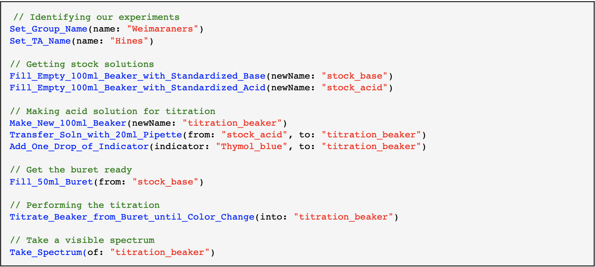

# Calvin — Your Online Chemistry Lab

#### A free platform for remote learning of chemistry through inquiry-based experimentation

### Requirements

**Instructor:**

-   Computer connected to the internet running Mac OS (Windows soon?)
-   A cloud drive, such as Box or Google Drive
-   [Igor Pro](https://www.wavemetrics.com) (free demo for one month,
    coursework license = \$125/yr)

**Students:**

-   A computer or tablet connected to the internet

**Level:**

-   Suitable for college-level general chemistry or AP high school
    chemistry

Calvin was designed to enable students enrolled at Cornell University to
perform our standard inquiry-based laboratory experiments *at home*
during the Covid-19 pandemic. Calvin is a compact interpreted language
that simulates student-designed experiments from laboratory data
collected at Cornell shortly prior to lock down.

Student groups (or individual students) design their experiments for
Calvin using a text editor. (Syntax coloring is available for a number
of popular free editors.) Students then e-mail their experiment to a
watched folder in the cloud that they cannot otherwise access. This
maintains confidentiality. Calvin opens the file, simulates the
experiment, generates a rtf file documenting the outcome and csv files
of any spectra produced, zips the whole shebang, and uploads the result
to a different folder that the students can access from an internet
browser. At Cornell, we have implemented this using Box, because it
enables Cornell authentication. Students can only access their specific
output folder.

Calvin is compatible with other cloud solutions, such as Google Drive;
however, some may not allow e-mail submission. Students could
alternatively drop their experiment file in a watched folder.

### A sample Calvin experiment

Experiments are described in a simple language that mimics spoken
English. For example, the box below shows a simple experiment where
Calvin titrates his stock acid solution with his stock base solution to
make sure everything is working. The syntax coloring is generated
automatically by the text editor.

### Calvin knows colors and spectra

Calvin produces data derived from actual experiments. Calvin output is saved in a .rtf file. For example, the
output from the simple titration above includes the solution color
before the titration began, the solution color after the endpoint was
reached, and the visible spectrum of the final solution, which is also
saved as a .csv file:

All of the data used by Calvin are real and were collected in the
undergraduate labs at Cornell University shortly before Cornell went on
lock down. All of the colors and spectra generated by Calvin are
calculated from actual spectra of indicators using the CIE 1931 color
space.

### Calvin likes unknowns

Calvin primary mission is to enable our students to perform
inquiry-based experiments such as:

-   The *pKa* of an Unknown Indicator
-   Identity of an Unknown Solid Acid
-   Composition of an Unknown Buffer

Calvin comes stocked with a wide range of known and unknown indicators,
solid acids, and buffers. The unknowns can be randomized and/or renamed
by changing a .csv file. More unknowns can be easily added by editing the .csv files.

### Calvin is adaptable

Think of Calvin as the chemicals, glassware, and spectrometers in a
teaching laboratory. You can use these materials to perform a wide range
of experiments, from very proscriptive activities to completely
inquiry-based experiments. Calvin is adaptable to your curriculum.

### Calvin ≠ programming

Calvin is not about programming. There is no "if this, then that." There
are no loops. Calvin's commands mimic spoken English.

Calvin uses a simple, low-bandwidth text interface, because some of my
students are in remote locations with poor internet access. I have
students from Alaska to Africa and everywhere in between!

### Calvin has robust error handling and is safe for your computer

Calvin obeys the same laws of chemistry as a real laboratory. "Pure"
H2O does not have a *p*H of 7.00 in my lab or in Calvin. Volumes
measured by pipette, buret, or graduated cylinder have realistic
precisions. Adding 125 mL of solution to a 100 mL beaker causes a spill
just like in the lab.

Calvin does not expose the operating computer to access by bad guys. The
computer running Calvin just transfers files back and forth to folders
in the cloud. Calvin ignores all commands except chemistry, so your
computer remains safe. Each experiment takes a few seconds for Calvin to
complete, so only a single computer is needed for even the largest
courses.

### Calvin is free (but requires Igor Pro)

Calvin is currently running on Mac OS, but I could get it running on
Windows if there is demand.

Calvin\'s output is in English. If there is demand, I could get it
running in other languages with some translation help.

### Learn More About Calvin

You may want
to look through:

-   [Student Guide to
    Calvin](https://github.com/MAHines/Calvin/blob/master/Documentation%20%26%20Expts/Calvin_Student_Guide.pdf)
-   [Instructors Guide to Deploying
    Calvin](https://github.com/MAHines/Calvin/blob/master/Documentation%20%26%20Expts/Instructor's%20Guide%20to%20Deploying%20Calvin.pdf)
-   [All Calvin
    Commands](https://github.com/MAHines/Calvin/blob/master/Command%20File.calvin)

We have used Calvin to run four experiments at Cornell. Three of the
experiments are inquiry-driven explorations of acid-base chemistry:
*pKa* of an Unknown Acid-Base Indicator, Identification of an Unknown
Solid Acid, and Composition of an Unknown Buffer. The have also used it
to measure the equilibrium constant for a simple reaction, Fe3+ +
SCN- ⇌ FeSCN2+. The student guides to these experiments are
available in the Documentation & Experiments folder:

-   [Three Acid-Base
    Experiments](https://github.com/MAHines/Calvin/blob/master/Documentation%20%26%20Expts/Three%20Acid-Base%20Experiments.pdf)
-   [Measuring an Equilibrium
    Constant](https://github.com/MAHines/Calvin/blob/master/Documentation%20%26%20Expts/Equilibrium_Constants.pdf)

### Using Calvin

If you use Calvin, please
send an e-mail to <Melissa.Hines@cornell.edu> letting me know your
location, your school, and approximately how many students Calvin will
impact. 

### Support

If you have a problem or find a bug, contact me at
<Melissa.Hines@cornell.edu>

### Important Disclaimer

I am an advocate of hands-on education. No simulation or computer
program can ever replace that. When normalcy returns, Calvin will
retire.

© 2020 Melissa A. Hines
